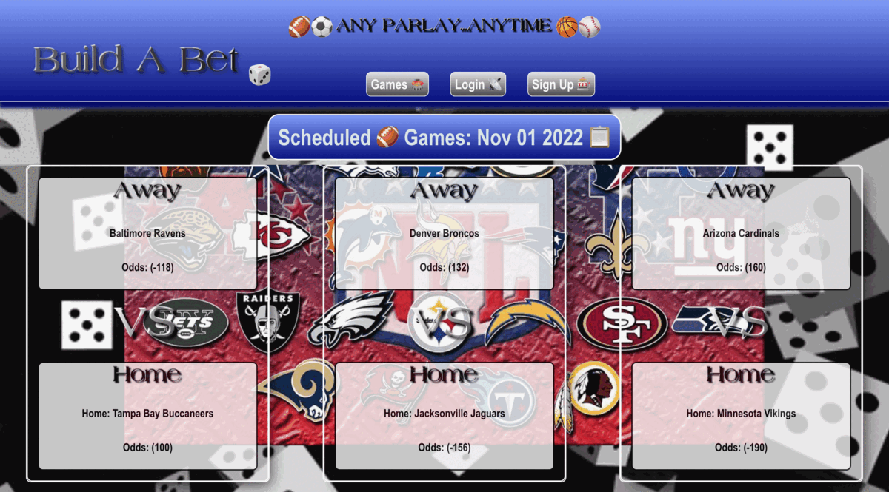
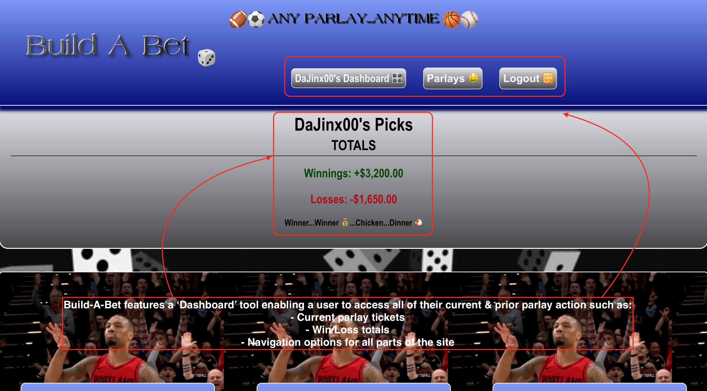
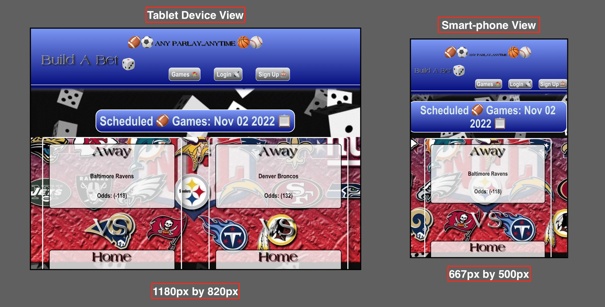

# **Build A Bet** [](#isc-license)
---

## Overview
---
**Build A Bet** is a webpage application powered by dynamic ```JavaScript``` via a "back-end" structure utilizing ```REACT.js``` with dependencies on ```MongoDB```, ```Mongoose```, ```GraphQL```, and ```Apollo``` for data maintenance, storage and queries. Additionally, the client-side will feature a user-friendly and intuitive experience by incorporating an ```HTML``` back-bone strongly supported by the ```REACT.js``` build technology.

This application allows users to access game-odds for sports and build their own parlay picks linked to their own user accounts. Furthermore, the site will feature secure login technology via ```JSONwebtokens``` combined with ```Bcrypt``` password encryption ,in order to ensure safe transactions and secured data.

Overall, **Build A Bet**  follows the ```MERN``` concept referencing "full-stack" development with a ```JavaScript``` powered "back-end" and a dynamic "front-end" rendered using ```REACT.js```. All of these combined languages and processes create the unique user experience while visiting the application's pages deployed via ```Heroku```. 

## Table of Contents
---

  * [Overview](#overview)
  * [User Story](#user-story)
  * [Acceptance Criteria](#acceptance-criteria)
  * [Installation](#installation)
  * [Mock Up](#mock-up)
  * [Contributions](#contributions)
  * [Deployed Application](#deployed-application)
  * [GitHUB Repository](#github-repository)
  * [Evaluation Guideline](#evaluation-guideline)
  * [Questions](#questions)
  * [License](#isc-license)

## User Story
---

```md
As a user, I want to be able to log into the website
As a user, I want to be able to view game odds
As a user, I want to be able to add games to my parlay
As a user, I want to be able to view my parlays
As a user, I want to see my expected payout given X amount bet
```

## Acceptance Criteria
---
> **Note:** The following criteria is used to determine if the standards set for **Build A Bet** have been met:

```md
WHEN I load the home page
THEN I see the games coming up with their associated odds
THEN I can also login to my account
WHEN I login to my account
THEN I can add games to my parlay and save it
WHEN I input a bet amount for the parlay
THEN I see the expected payout
WHEN I go to the My Parlays page
THEN I can see all of my parlays
```
## Installation
----
> **Important:** Once, the source code has been cloned from the repository @https://github.com/AASports89/build-a-bet

 Enter the following to initiate the required application package installations, seeding, & run process:

 ```
 npm run seed
 ```
 -followed by-

 ```
 npm run install concurrently
 ```
 -followed by-
 ```
 npm run build concurrently
 ```
 -followed by-
 ```
 npm run develop
 ```
 in the terminal cmd to install & run locally via PORT 3000.

## Mock-Up
---
> **Note:**  The following animation shows the application's look and functionality:

> **Application Look:** 

> **Dashboard:** 

> **Sign Up:** 

> **Mobile-Device View:** 

## Contributions
---
* Aram A. - Coded back-end ```Components```, ```TypeDefs```, ```HandleSubmit``` form & numerous ```index.css``` classes and register for the ```ODDS-API``` key to pull live betting odds.

* Christoper W. - Coded ```Models```, ```Resolvers```, ```QUERY``` parameters & assisted with establishing functionality.

* Jonathan  L. - Styled & coded ```Pages``` sections, ```Home```, ```Login``` & ```Sign Up``` functionalities.

*  Rence S. - Helped with styling, and with various other components throughout the application.

## Deployed Application
---
> https://build-a-bet.herokuapp.com/

## GitHUB Repository
---
> https://github.com/AASports89/build-a-bet

## Evaluation Guideline
---

> **Note**: The following evaluation guideline is used to determine if **Build A Bet** meets the requirements for a minimum viable product:
```
### Deliverables: 10%

* The GitHub repository containing your application code.

### Presentation & App Demo: 37%

*The presentation should encompass the entire process of developing the application, from planning to final product in a concise yet detailed fashion.

*During the demonstration, the application should be able to process basic user routes retrieving and modifying relevant data.

### Technical Acceptance Criteria: 40%

* Satisfies all of the preceding acceptance criteria plus the following:

  * Connects to a MongoDB database using the [MongoDB](https://www.npmjs.com/package/mongodb) and [Mongoose](https://www.npmjs.com/package/mongoose) packages.

  * Stores sensitive data, like a user’s MongoDB username, password, and database name, using environment variables through the [dotenv](https://www.npmjs.com/package/dotenv) package.

  * Syncs Mongoose models to a MongoDB database on the server start.

  * Includes column definitions for all four models outlined in the Project instructions.

  * Includes model associations outlined in the Project instructions.

### Repository Quality: 13%

* Repository has a unique name.

* Repository follows best practices for file structure and naming conventions.

* Repository follows best practices for class/id naming conventions, indentation, quality comments, etc.

* Repository contains multiple descriptive commit messages.

* Repository contains quality readme with description and a link to the deployed application webpaged based in Heroku.
```

## Questions
---
> **Note:** For any troubleshooting and/or functionality related questions, please visit my GitHUB @https://github.com/AASports89.

## **ISC License**
---
**Copyright © 2022 - DaParlaySquad™ 🎲**

Permission to use, copy, modify, and/or distribute this software for any purpose with or without fee is hereby granted, provided that the above copyright notice and this permission notice appear in all copies.

THE SOFTWARE IS PROVIDED "AS IS" AND THE AUTHOR DISCLAIMS ALL WARRANTIES WITH REGARD TO THIS SOFTWARE INCLUDING ALL IMPLIED WARRANTIES OF MERCHANTABILITY AND FITNESS. IN NO EVENT SHALL THE AUTHOR BE LIABLE FOR ANY SPECIAL, DIRECT, INDIRECT, OR CONSEQUENTIAL DAMAGES OR ANY DAMAGES WHATSOEVER RESULTING FROM LOSS OF USE, DATA OR PROFITS, WHETHER IN AN ACTION OF CONTRACT, NEGLIGENCE OR OTHER TORTIOUS ACTION, ARISING OUT OF OR IN CONNECTION WITH THE USE OR PERFORMANCE OF THIS SOFTWARE.

---
---